```{r setup, include=FALSE}
knitr::opts_chunk$set(echo = FALSE)
```


# Overview

This assignment is based on the mini-challenge in [**VAST Challenge 2021**](https://vast-challenge.github.io/2021/). The selected challenge topic for this assignment is [**Mini-Challenge 1**](https://vast-challenge.github.io/2021/MC1.html). 

In the roughly twenty years that Tethys-based GAStech has been operating a natural gas production site in the island country of Kronos, it has produced remarkable profits and developed strong relationships with the government of Kronos. However, GAStech has not been as successful in demonstrating environmental stewardship.

In January 2014, the leaders of GAStech are celebrating their new-found fortune as a result of the initial public offering of their very successful company. In the midst of this celebration, several employees of GAStech go missing. An organization known as the Protectors of Kronos (POK) is suspected in the disappearance, but things may not be what they seem.

The Protectors of Kronos (POK) is a political activist movement stemmed from concerns about contamination from drilling at the Tiskele Bend gas fields. An international agency has tested water from the Tiskele River both upstream and downstream of the Tiskele Bend gas fields and confirmed that the presence of contaminants is consistent with pollution from Hyper Acidic Substrate Removal, a gas drilling technique employed by GAStech at the Tiskele Bend fields and these test results have also been published in several international journals. 

My role is to use visual analytics to help law enforcement from Kronos and Tethys discover the relationships among the people and organizations.

# Background

Mini-Challenge 1 looks at the relationships and conditions that led up to the kidnapping. As an analyst, I'd be analysing a set of current and historical news reports, resumes of numerous GAStech employees and email headers from two weeks of internal GAStech company email to identify the complex relationships among all of these people and organizations.

# Literature Review, Objective and Motivation 

In the literature review conducted of the 2014 VAST Challenge submissions covering the same crime case but with different questions, it was observed that many of the visualizations were quite informative and had their own strengths but there were some limitations or areas to improve as well. 

Some areas that can be further improved on:

- Unidirectional tree diagrams were used to display relationships, but such diagrams lack the ability to show the dynamics of how multiple parties act as connectors of the various organizations/people

- Cluttered network diagrams with labels obscured by arrows

- Some of the network diagrams for emails between GAStech employees were not easy to visualize some embedded relationships (e.g. relationships within the department) 

The proposed visualizations will attempt to overcome some of these limitations. 

The participants used a variety of tools for their visualizations. For this assignment, the approach will be to utilize R programming solely as there are numerous visualization packages available in the R environment with useful functions and great adaptability. There are also many new packages constantly being pushed out in the R community. For this assignment, some of the newer R packages will also be explored and applied, including [**corporaexplorer**](https://cran.r-project.org/web/packages/corporaexplorer/index.html) published in 2021, [**patchwork**](https://cran.r-project.org/web/packages/patchwork/index.html) published in 2020 and [**LDAvis**](https://cran.r-project.org/web/packages/LDAvis/index.html) published in 2015.  
 
   
# Data Preparation

Data extraction, wrangling and data preparation were performed with R, primarily with tidyverse methods. 

This code chunk installs and launches relevant R packages:

```{r class.source="watch-out", eval=FALSE, echo=TRUE}
packages = c('tidytext', 'widyr', 'wordcloud', 'DT', 'ggwordcloud', 'dplyr', 'textplot', 
             'lubridate', 'hms', 'tidyverse', 'tidygraph', 'ggraph', 'igraph', 'scales', 
             'tidyr', 'purrrlyr', 'RColorBrewer', 'ggplot2', 'htmlwidgets', 'plotly', 
             'extrafont', 'stringr', 'corporaexplorer', 'stringi', 'stringr', 'tibble',
             'rvest', 'readr', 'purrr', 'future', 'tictoc', 'lda', 'topicmodels', 
             'LDAvis', 'tidyHeatmap', 'utf8','tm', 'readtext', 'data.table', 'textreadr',
             'SnowballC', 'RColorBrewer', 'ggplot2', 'wordcloud', 'biclust', 'cluster', 
             'igraph', 'fpc', 'igraph', 'ggiraph', 'visNetwork', 'networkD3',
             'lubridate', 'anytime', 'quanteda', 'reshape2', 'jsonlite', 'sentimentr', 
             'textdata', 'rlist', 'viridisLite', 'viridis', 'topicmodels', 'readxl', 
             'ggthemes', 'ggalluvial', 'clock', 'hrbrthemes', 'patchwork', 'anytime')
for (p in packages){
 if(!require(p, character.only=T)) {
 install.packages(p)
 }
 library(p, character.only = T)
}
```


Reading the articles from the News Articles folder and compiling them in a tibble format and saving it in rds format:

```{r class.source="watch-out", eval=FALSE, echo=TRUE}
news <- "News Articles/"

read_folder <- function(infolder) {
  tibble(file = dir(infolder, full.names= TRUE)) %>%
  mutate(text = map(file, read_lines)) %>%
  transmute(id = basename(file), text) %>%
  unnest(text)
  
raw_text <- tibble(folder = dir(news, full.names = TRUE)) %>%
  mutate(folder_out = map(folder, read_folder)) %>%
  unnest(cols = c(folder_out)) %>%
  transmute(newsgroup = basename(folder), id, text)
write_rds(raw_text, "rds/news.rds")  
```

Performing EDA on the news articles by news group:

```{r class.source="watch-out", eval=FALSE, echo=TRUE}
raw_text %>% 
  group_by(newsgroup) %>%
  summarize(messages = n_distinct(id)) %>%
  ggplot(aes(messages, newsgroup)) + 
  geom_col(fill = "lightblue") + 
  labs(y = NULL)
```

Cleaning the raw text data and saving it as cleaned_text:

```{r class.source="watch-out", eval=FALSE, echo=TRUE}
cleaned_text <- raw_text %>%
  group_by(newsgroup, id) %>%
  filter(cumsum(text =="") > 0, 
         cumsum(str_detect(text, "^--")) == 0) %>%
  ungroup()
```

Filter out undesired portion of the cleaned_text depending on context: 

```{r class.source="watch-out", eval=FALSE, echo=TRUE}
cleaned_text <- cleaned_text %>%
                    filter(!str_detect(text, "PUBLISHED\\:")) %>%
                    filter(!str_detect(text, "LOCATION\\:")) %>%
                    filter(!str_detect(text, "SOURCE\\:")) %>%
                    filter(!str_detect(text, "AUTHOR\\:")) %>%
                    filter(!str_detect(text, "\\d+:")) %>%
                    filter(!str_detect(text, "aandacht")) %>%
                    filter(!str_detect(text, "TITLE\\:")) %>% 
                    filter(!str_detect(text, "continue\\reading"))
```

Tokenizing the cleaned text:

```{r class.source="watch-out", eval=FALSE, echo=TRUE}
usenet_words <- cleaned_text %>%
  unnest_tokens(word, text) %>%
  filter(str_detect(word, "[a-z']$"), !word %in% stop_words$word, !str_detect(word, "title")
  )
```

Grouping words based on newsgroup:

```{r class.source="watch-out", eval=FALSE, echo=TRUE}
words_by_newsgroup <- usenet_words %>%
  count(newsgroup, word, sort = TRUE) %>%
  ungroup()
```

# Answers

**Qn 1: Characterize the news data sources provided. Which are primary sources and which are derivative sources? What are the relationships between the primary and derivative sources?**

To determine whether a news article is a primary or derivative source, a few visualisations would be used. 

There are many characteristics that differentiate a primary and derivative source. A derivative source is any record that relies on other records for its information. 

As derivative sources are second-hand account of events, they will cover information from the primary source, often providing additional analysis and interpretation. A correlation analysis of documents published by the news companies can help give us clues in the primary and derivative source relationships. 

First, the correlation is set very low to allow us to explore the overall correlation between all the news sources of the different companies. 

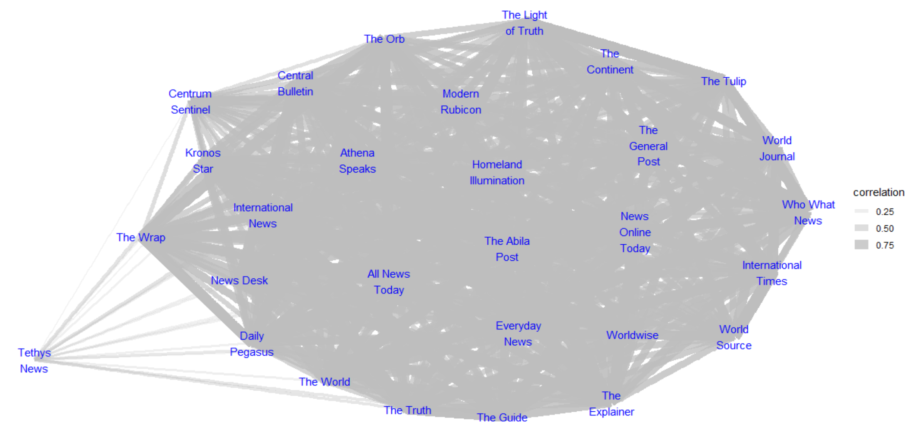

Tethys News is an outlier and needed a closer inspection for analysis.

A corpus exploration tool created from ‘corporaexplorer’ package in R was used. Tethys News’ articles have an update timestamp instead of just a publication date which suggests that their reporting are quite recent/close to the event.  News that are written or made during or close to the time of the event is a characteristic of a primary source. Hence, Tethys News is likely to be a primary source. 
 
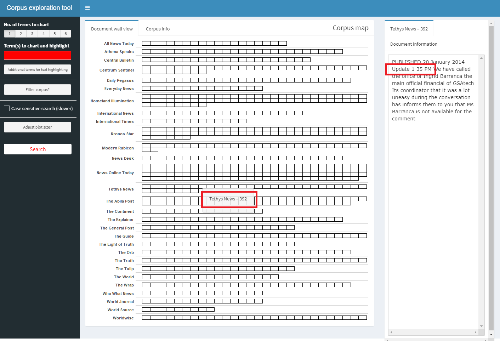

A high correlation of the news companies suggests that that the articles between the two companies are highly similar and that they may either both be derivative sources as they analyse and interpret each other’s work or that one is a primary source and the other is a derivative source as the latter aims to analyse and interpret the primary source, hence referencing a substantial amount of content from the primary source to facilitate analysis/interpretation. A correlation of 0.70 is selected to evaluate the relationships. 


A number of clusters were formed with Centrum Sentinel and Modern Rubicon being quite far from the group, suggesting that they have higher likelihood of being of a primary source. 

For the others with high correlation with each other, they are likely to be derivative sources.

For instance, Athena Speaks and Central Bulletin have a correlation of more than 0.8. This suggests that their news articles are highly similar.

**Codes for the correlation visualizations**

Performing a pairwise correlation:

```{r class.source="watch-out", eval=FALSE, echo=TRUE}
newsgroup_cors <- words_by_newsgroup %>%
  pairwise_cor(newsgroup, word, n, sort = TRUE)
```

Visualising the pairwise correlation at **r = 0.1**:

```{r class.source="watch-out", eval=FALSE, echo=TRUE}
set.seed(123)

newsgroup_cors %>%
  filter(correlation > .1) %>%
  graph_from_data_frame() %>%
  ggraph(layout = "nicely") +
  geom_edge_link(aes(alpha = correlation, width = correlation), color="grey") +
  #geom_node_point(size = 4, color = "lightblue") +
  geom_node_text(aes(label = vapply(name, str_wrap, character(1), width = 10)), colour = "blue", size =4) +

theme_void()
```

Visualising the pairwise correlation at **r =0.7**:

```{r class.source="watch-out", eval=FALSE, echo=TRUE}
set.seed(123)

newsgroup_cors %>%
  filter(correlation > .7) %>%
  graph_from_data_frame() %>%
  ggraph(layout = "nicely") +
  geom_edge_link(aes(alpha = correlation, width = correlation), color="grey") +
  geom_node_point(size = 4, color = "lightblue") +
  geom_node_text(aes(label = vapply(name, str_wrap, character(1), width = 10)), colour = "blue", size =4) +

theme_void()
```


The corpus exploration tool is used to examine the articles in two news companies. To allow a focus on a common topic, the corpus filter setting is set to include “kidnap—1”. This phrase will prompt the corporaexplorer to keep only articles with the word “kidnap” appearing at least once.

A comparison between Athena Speaks – 140 article and Central Bulletin – 673 article shows that their articles’ content are almost identical with just a paraphrasing of the text, suggesting that they are likely both derivative sources of another source or a record of each other. 

**Athena Speaks - Article 140**	
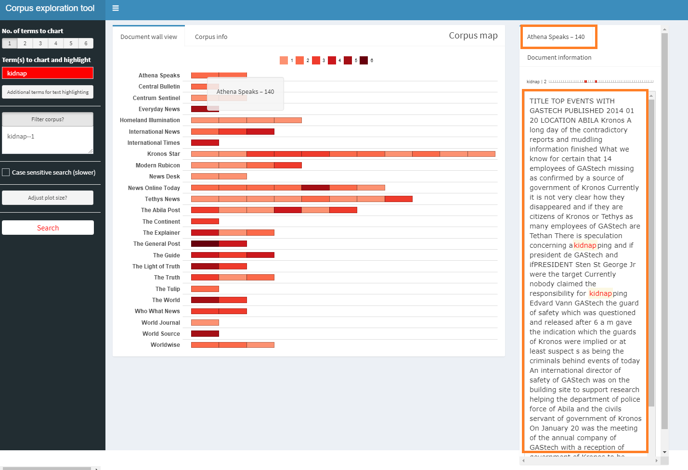
**Central Bulletin - Article 673**
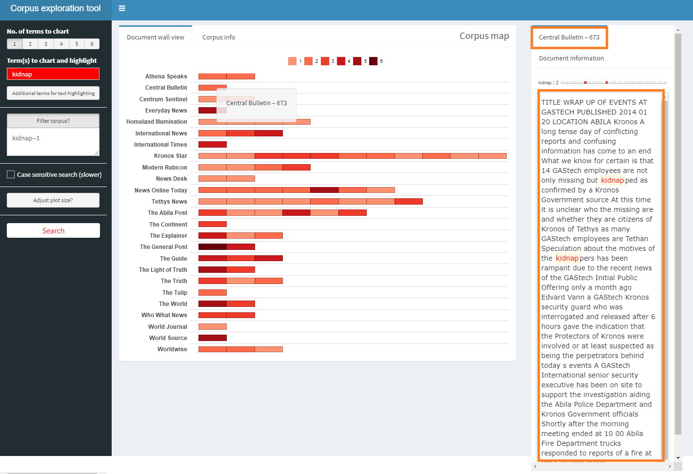
 
The corpus exploration tool created from the R package can also allow us to have a quick overview of the primary and derivative sources with its key term highlight function. 

Primary sources include original document information such as interviews. Hence, the term “say” can be used to locate the primary source article as they represent first-hand accounts. This is placed in the red-colored term to chart and highlight. The name of others news companies can be used to locate the derivative source articles.  This is placed in the blue-colored term to chart and highlight.
   
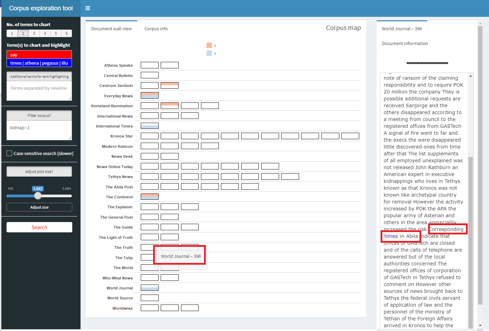

In the above created visualization, one can now quickly differentiate the primary and derivative sources by referring to the red-colored tiles for the primary source and blue-colored tiles for the derivative sources. For example, World Journal - Article 396 was flagged as a derivative source with its blue tile. After clicking on the tile, the document information pops up on the right and indeed, there was a reference made to "corresponding times in Abila" suggesting that World Journal is indeed a derivative source. 

Based on the above visualization, we can also infer that Centrum Sentinel and Homeland Illumination have primary source articles with the red document tiles. 

It is helpful to understand which news source are primary sources and derivative sources as the law enforcers can derive different types of value from this two group of sources. For example, primary source are especially useful to get the latest accurate updates and to ensure minimum "embellishment" that can bring about confusion to the case. Derivative sources are especially useful for understand history of related personnel or uncover certain goals of suspects since additional research, compilation and analysis has gone into derivative sources.  

**Codes for the corporaexplorer visualizations**

For the corporaexplorer visualizations, we do not want the filters earlier applied for the correlation plots. We want to keep the news articles with their fields intact (e.g. Published: 20 January 2014) for improved analysis performance. 

Extracting the cleaned_text from raw_text without filtering out fields such as *filter(!str_detect(text, "PUBLISHED\\:"))*: 

```{r class.source="watch-out", eval=FALSE, echo=TRUE}

cleaned_text <- raw_text %>%
  group_by(newsgroup, id) %>%
  filter(cumsum(text =="") > 0, 
         cumsum(str_detect(text, "^--")) == 0) %>%
  ungroup()
```

Converting the text to string format and to remove all non-word characters with a blank space:

```{r class.source="watch-out", eval=FALSE, echo=TRUE}

cleaned_text$text <- str_replace_all(cleaned_text$text, "\\W" ," ")
```

Remove any rows in the text column with empty spaces:

```{r class.source="watch-out", eval=FALSE, echo=TRUE}

cleaned_text <- cleaned_text[!cleaned_text$text=="",]
cleaned_text <- cleaned_text[!cleaned_text$text==" ",]

```

Grouping the cleaned_text by id and use dplyr's summarise function to combine all rows of text in one row by id:

```{r class.source="watch-out", eval=FALSE, echo=TRUE}
cleaned_text <- cleaned_text %>% dplyr::group_by(id) %>%
  dplyr::summarise(Text = paste(text, collapse = " "), .groups = "drop_last") 
```

Unnesting the Text column data:

```{r class.source="watch-out", eval=FALSE, echo=TRUE}
cleaned_text <- tidyr::unnest(cleaned_text, Text)
```

Separate out the id column into individual id column (e.g. id1 = "Tethys News", id2 = "121", id3 = "txt"):

```{r class.source="watch-out", eval=FALSE, echo=TRUE}
cleaned_text <- cleaned_text %>% 
    tidyr::separate(id, c("id1", "id2", "id3"), sep="[-.]")
```

Removing id3 as it only captures the word "txt":

```{r class.source="watch-out", eval=FALSE, echo=TRUE}
cleaned_text <- subset(cleaned_text  , select = -c(id3))
```

Renaming id1 and id2 columns to more intuitive titles:

```{r class.source="watch-out", eval=FALSE, echo=TRUE}
names(cleaned_text)[names(cleaned_text) == "id2"] <- "ArticleNo"
names(cleaned_text)[names(cleaned_text) == "id1"] <- "NewsGroup"
```

Use corporaexplorer's explore function after setting the required definitions below:

```{r class.source="watch-out", eval=FALSE, echo=TRUE}
cleaned_text$for_tab_title <- paste(cleaned_text$NewsGroup, cleaned_text$ArticleNo)
corpus_revised <- prepare_data(cleaned_text, date_based_corpus = FALSE, grouping_variable = "NewsGroup", within_group_identifier = "ArticleNo", columns_doc_info = colnames(cleaned_text)[1:5], tile_length_range=c(2,2), use_matrix=FALSE)
explore(corpus_revised)
```


**Qn 2: Characterize any biases you identify in these news sources, with respect to their representation of specific people, places, and events. Give examples.**
 
The news sources have different biases and their bias leads them to look at the potential culprits of the crime from different perspectives, coming to different hypotheses. While bias is typically negative, in this case, it can help us examine the different possible motivations of suspects and consider the scenarios to investigate. 

The focus of examination is targeted in the year 2014 as the kidnapping occurred in Jan of 2014. The data is filtered to only include news sources in 2014. 

```{r class.source="watch-out", eval=FALSE, echo=TRUE}
cleaned_text <- dplyr::filter(cleaned_text , grepl('2014', Text))
```

Before diving into the biases, below is a word cloud to provide an overview of related people, places and events in 2014, the year of the kidnapping.

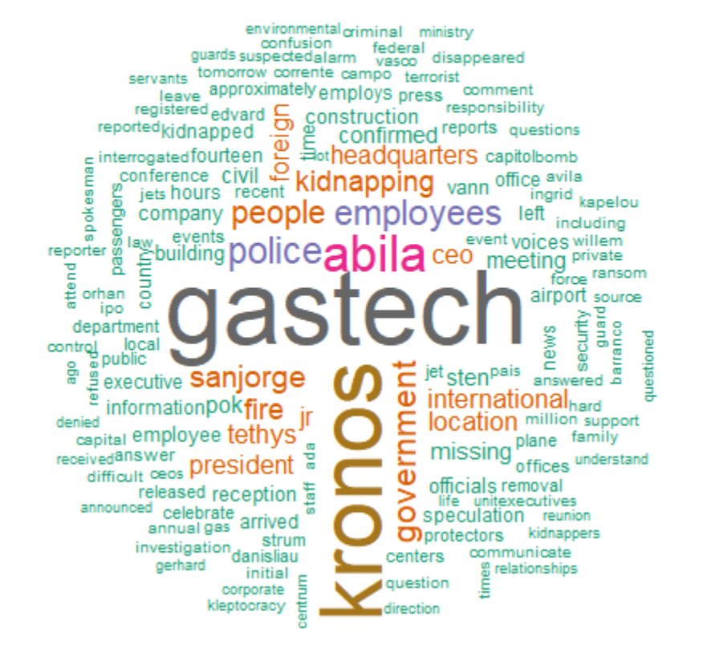

**Code for the wordcloud**

The below filtering is required for a more optimal wordcloud analysis:

```{r class.source="watch-out", eval=FALSE, echo=TRUE}
cleaned_text <- cleaned_text %>%
                    filter(!str_detect(Text, "PUBLISHED\\:")) %>%
                    filter(!str_detect(Text, "LOCATION\\:")) %>%
                    filter(!str_detect(Text, "SOURCE\\:")) %>%
                    filter(!str_detect(Text, "AUTHOR\\:")) %>%
                    filter(!str_detect(Text, "\\d+:")) %>%
                    filter(!str_detect(Text, "aandacht")) %>%
                    filter(!str_detect(Text, "TITLE\\:")) %>% 
                    filter(!str_detect(Text, "continue\\reading"))
```

Most articles have subtitle words such as "published" and "title" and these are not meaningful for analysis.

Such words are not useful for analysis and are filtered out:

```{r class.source="watch-out", eval=FALSE, echo=TRUE}
usenet_words <- cleaned_text %>%
  unnest_tokens(word, Text) %>%
  filter(str_detect(word, "[a-z']$"), !word %in% stop_words$word, !str_detect(word, "title"),
         !str_detect(word, "jan"),!str_detect(word, "published"), !str_detect(word, "update"),  
         !str_detect(word, "pm"), !str_detect(word, "blog"), !str_detect(word, "day"), 
         !str_detect(word, "morning")
  )
```

Perform a count of words:

```{r class.source="watch-out", eval=FALSE, echo=TRUE}
words_wordcloud <- usenet_words %>%
  count(word, sort = TRUE) %>%
  ungroup()
```

Use the wordcloud function for the wordcloud:

```{r class.source="watch-out", eval=FALSE, echo=TRUE}
pal2 <- brewer.pal(8,"Dark2")
wordcloud(words_wordcloud$word, words_wordcloud$n, min.freq=5,
max.words=150, random.order=FALSE, rot.per=.15, colors=pal2)
```


Topic modelling of the news sources were performed to allow us to have a good overview of the bias via the topics. 

The summary of the topics are as below:

Topic 1	| Topic 2	| Topic 3 | Topic 4 |
---------| ---------| --------- | ---------
Missing GAStech employees jumped the city with their newfound wealth from the IPO	|<br>The kidnappers are linked to POK and APA. <br>   <br>|The kidnappers are linked to increasingly “anarchist” POK. |<br> External people dressed in black were the suspects. There were comments that they were “lurking approximately” when the fire alarm sounded off. They are also suppliers for the breakfast meeting in the morning of the kidnapping|

The heatmap diagram below shows the topic and corresponding leaning bias that each newsgroup fall into. 

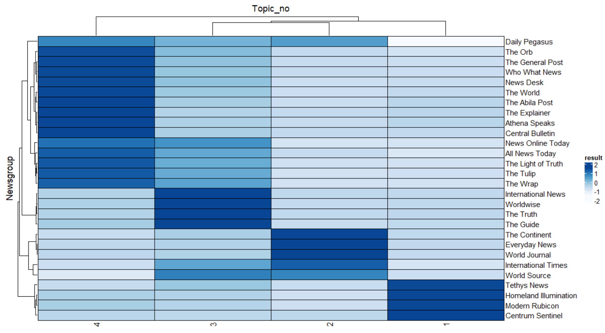

**Topic 1**: The bias is positive towards the government as the keywords *stone unturned* here refer to the data sources justifying that the police force or government's mistake in wrongly detaining Edvard Vann due to a confusion of identity linked to his family name. 

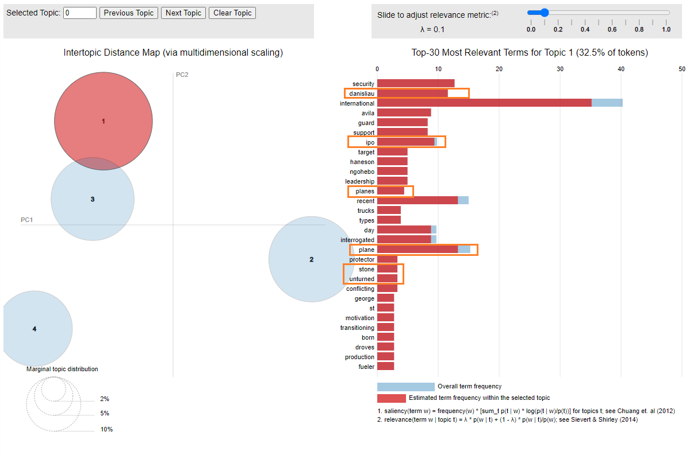
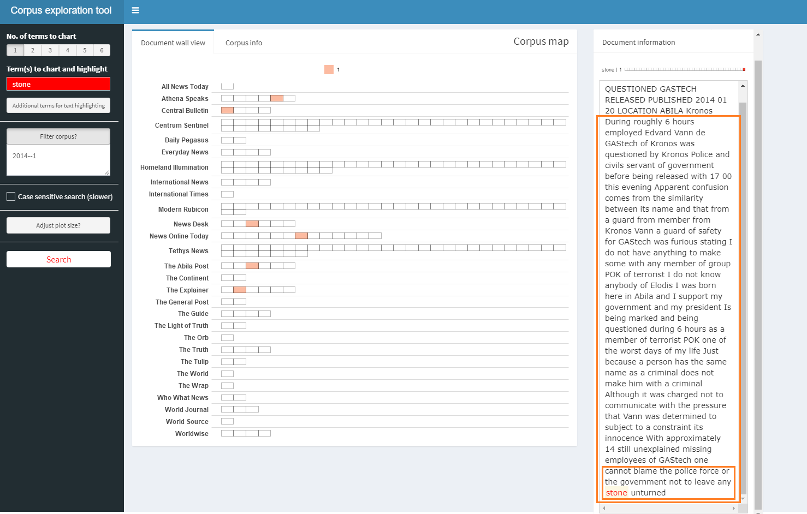 
The key word *Danisliau* refers to the fueler Ravi Danislau who shaerd that he saw two private jets leaving the airport of Abila today carrying "business types" people. 

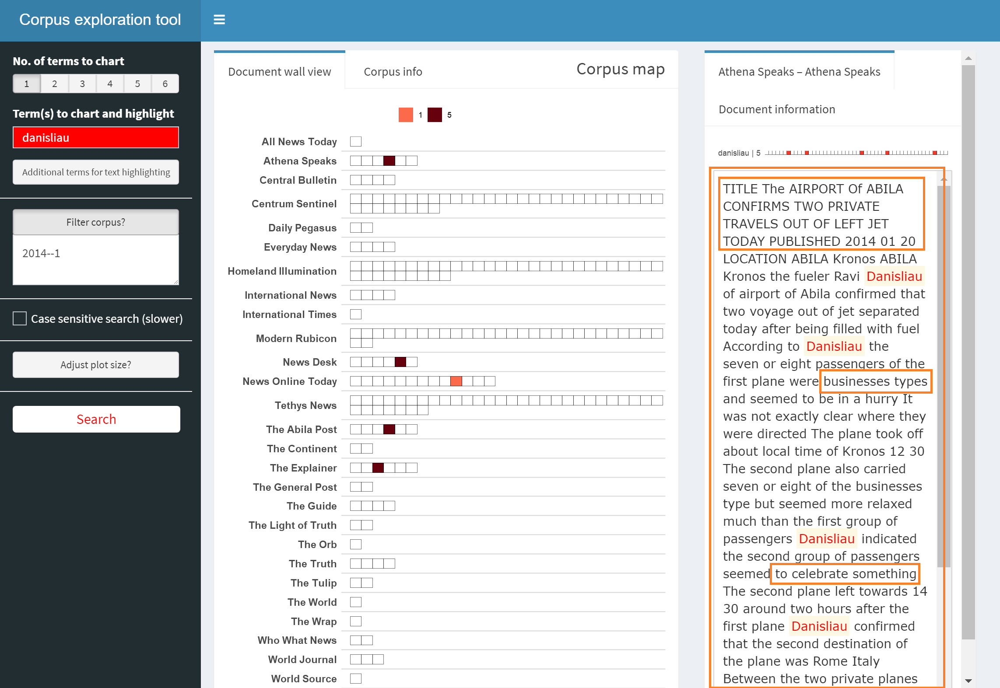 

Overall, data sources in this topic seems to indicate a bias against GAStech executives escaping on their private jets with the wealth from their *IPO*. 
 

**Topic 2**: The bias is against APA. Data sources falling in this category have a number of references to APA and their related activities. A suggestion is that the kidnapping could be due to APA, Army of People of Asterian along with POK. 

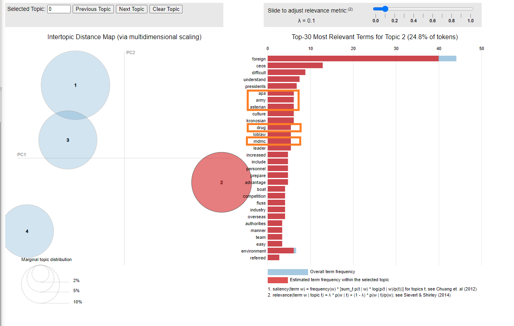 
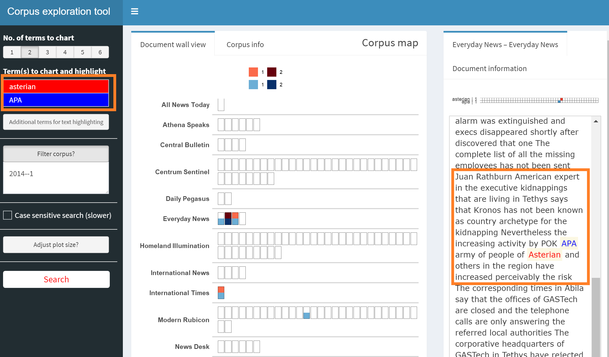 

**Topic 3**: Data sources falling in this category view the Kronos government and GAStech executives rather negatively as there is the key word *kleptocracy* suggesting corruption between the Kronos public officials and GAStech executives. They do believe that a kidnapping may have occurred as POK has become increasingly *anarchist*, indicating that they may have been more supportive of POK in the past before it started to get more radicalized.  
  
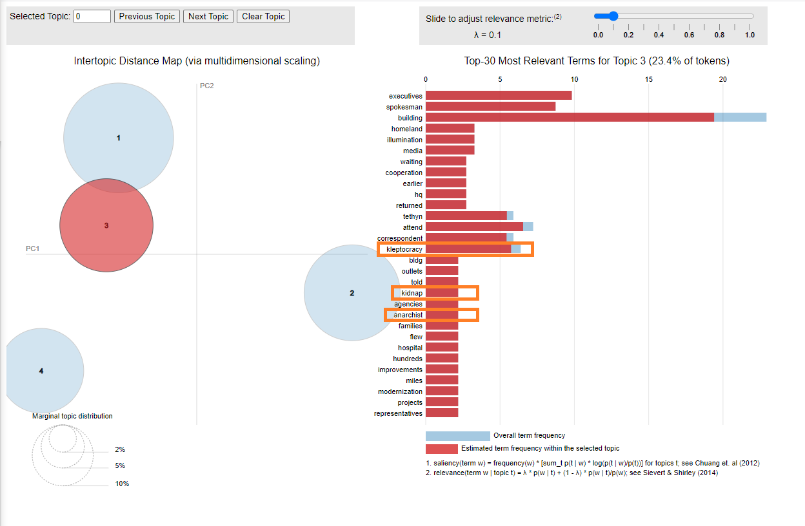 
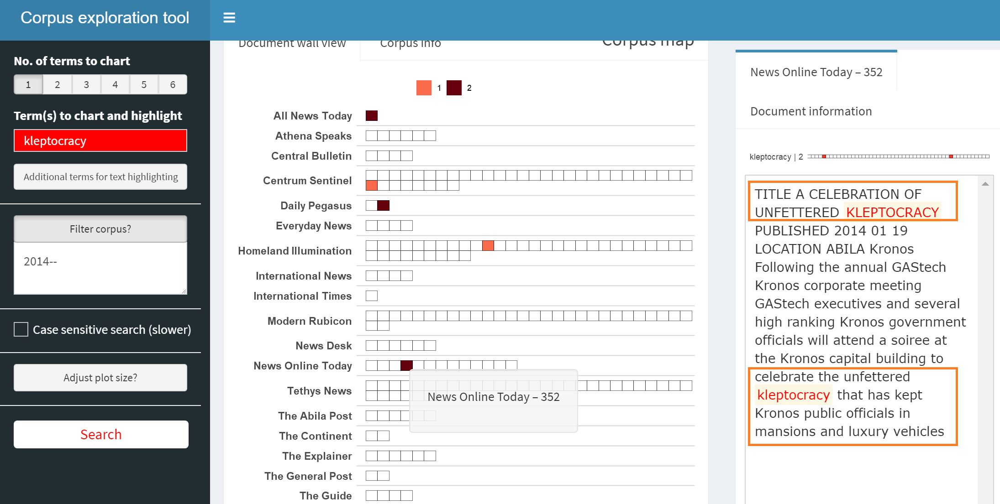 
 
**Topic 4**: Data sources falling in this category are not biased against POK, APA or the GAStech executives and hence lean towards GAStech employees' testimonials instead. Based on their testimonials of seeing unknown people *dressed* in black, they become this group of data sources' main suspect. The *coordinator* of GAStech informed that these people were the suppliers/caterers for the morning's breakfast on the day of the kidnapping and there were some suggestions to investigate these people. 

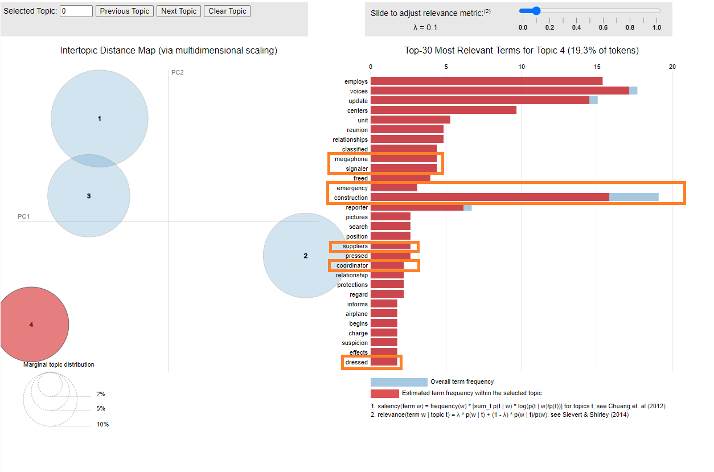 
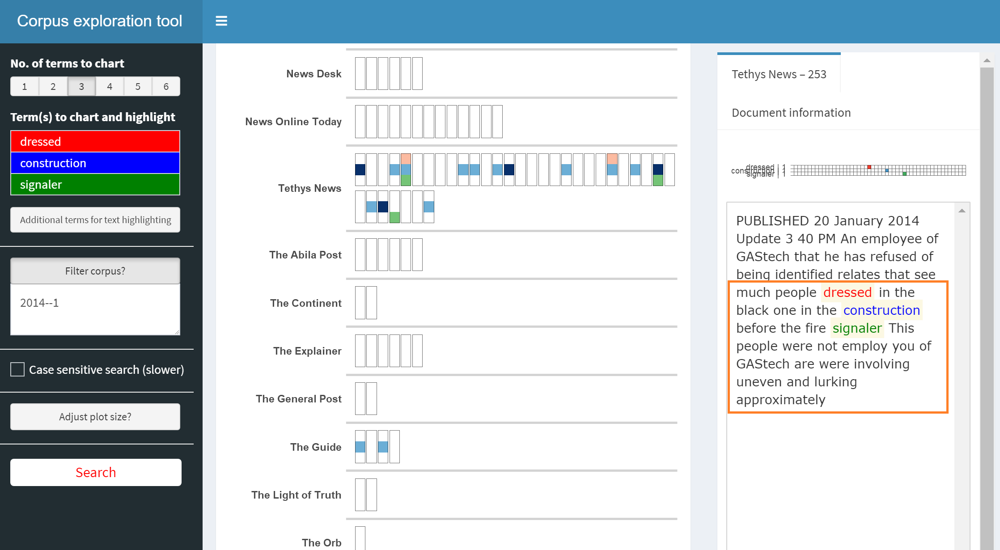 
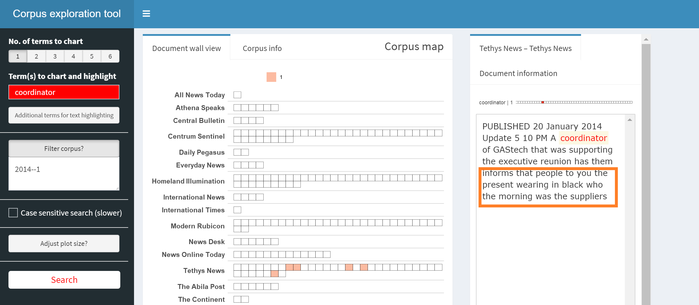

--

**Code for topic modeling**

Remove column that is not required from the cleaned_text dataframe:

```{r class.source="watch-out", eval=FALSE, echo=TRUE}
cleaned_text_lda <- subset(cleaned_text, select = -c(for_tab_title))
```

There were news about Singapore in the news articles but upon close examination of them in the Corporaexplorer, it was determined that they are not directly relevant to the crime investigation and the word was removed before topic modeling. There were also some spelling errors or duplicate words detected and they were removed.

Tokenization and removing words that are not helpful to the analysis:

```{r class.source="watch-out", eval=FALSE, echo=TRUE}
usenet_words_lda <- cleaned_text_lda %>%
  unnest_tokens(word, Text) %>%
  filter(str_detect(word, "[a-z']$"), !word %in% stop_words$word, !str_detect(word, "title"), 
         !str_detect(word, "caf"), !str_detect(word, "singapur"), !str_detect(word, "jr"), 
         !str_detect(word, "singapore"),!str_detect(word, "threats"), 
         !str_detect(word, "international's"), !str_detect(word, "jan"), !str_detect(word, "pm") 
  )
```

Perform a word count: 

```{r class.source="watch-out", eval=FALSE, echo=TRUE}
words_by_newsgroup_lda <- usenet_words_lda %>%
  count(NewsGroup, word, sort = TRUE) %>%
  ungroup()
```

Create a tf-idf: 

```{r class.source="watch-out", eval=FALSE, echo=TRUE}
tf_idf <- words_by_newsgroup_lda %>%
  bind_tf_idf(word, NewsGroup, n) %>%
  arrange(desc(tf_idf))
```

Convert the tf_idf data into a document term matrix format:

```{r class.source="watch-out", eval=FALSE, echo=TRUE}
tf_dtm <- tf_idf %>% cast_dtm(document = NewsGroup, term = word, value = n)
tf_dtm
```

Create LDAVis:

```{r class.source="watch-out", eval=FALSE, echo=TRUE}

topicmodels_json_ldavis <- function(fitted, doc_term){
    require(LDAvis)
    require(slam)

    # Find required quantities
    phi <- as.matrix(posterior(fitted)$terms)
    theta <- as.matrix(posterior(fitted)$topics)
    vocab <- colnames(phi)
    term_freq <- slam::col_sums(doc_term)

    # Convert to json
    json_lda <- LDAvis::createJSON(phi = phi, theta = theta,
                            vocab = vocab,
                            doc.length = as.vector(table(doc_term$i)),
                            term.frequency = term_freq)

    return(json_lda)
}

set.seed(1234)

topic_res <- LDA(tf_dtm, 4)
tf_12_json <- topicmodels_json_ldavis(
  fitted = topic_res,
  doc_term = tf_dtm
)
```

View the LDAvis on the server:

```{r class.source="watch-out", eval=FALSE, echo=TRUE}
serVis(tf_12_json)
```

Applying the newsgroups back to the topic distribution:

```{r class.source="watch-out", eval=FALSE, echo=TRUE}
lda.model <- topicmodels::LDA(tf_dtm, 4, method = "Gibbs", control = list(iter=2000, seed = 1234))
theta <- as.data.frame(topicmodels::posterior(lda.model)$topics)
theta
```

Converting the theta results into a tibble format:

```{r class.source="watch-out", eval=FALSE, echo=TRUE}
theta_tidy <- 
    theta %>% 
    as_tibble(rownames="Newsgroup") 

theta_tidy
```

Pivoting long to change the tibble format into heatmap function's required format with TidyR:

```{r class.source="watch-out", eval=FALSE, echo=TRUE}
theta_tidy <- theta_tidy %>%
 tidyr::pivot_longer(
     cols = starts_with("Topic"), 
     names_to = "Topic_no", 
     values_to = "result", 
     names_prefix = "Topic_")
```

Apply the heatmap function and visualize the heatmap:

```{r class.source="watch-out", eval=FALSE, echo=TRUE}
theta_tidy_heatmap <- 
    theta_tidy %>%
    heatmap(Newsgroup, Topic_no, result, 
            rect_gp = grid::gpar(lwd = 0.5), col= colorRampPalette(brewer.pal(8, "Blues"))(25)) 

theta_tidy_heatmap
```


**Qn 3: Given the data sources provided, use visual analytics to identify potential official and unofficial relationships among GASTech, POK, the APA, and Government. Include both personal relationships and shared goals and objectives. Provide evidence for these relationships.**

*Personal relationships among GAStech employees*

Non-work related emails sent between colleagues at GAStech can help us uncover personal relationships among the GAStech employees as the frequency of such emails suggest a closer personal relationship. 

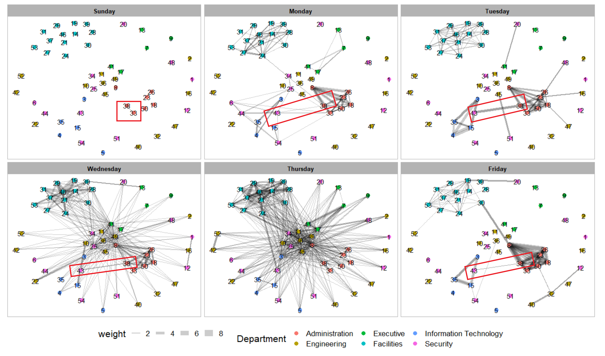
 
There are two pairs of relationships in the above diagram that are particularly striking. 

One is between Rachel Pantanal (id: 38), Assistant to CIO and Isia Vann (id: 43), Perimeter Control. They display a close relationship as we can see that they exchange non-work related emails with each other on majority of the days in the week (Monday, Tuesday, Wednesday, Friday). On closer inspection of their emails, there was an email about whether Rachel liked the flowers and she responded positively. This suggests a potential romantic relationship between the both of them. Isia Vann has a personal grudge against GAStech for the death of his sister and is part of the more radical-minded members at POK according to the historical documents. If he is in a romantic relationship with Rachel, Rachel may be sympathetic to his causes. 

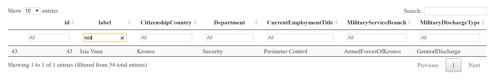

Another pair is Rachel Pantanal (id: 38) and Ruscella Mies Haber (id: 33) as they shared a non-work related email exchange on Sunday. It is very unusual for employees at GAStech to send non-work related emails to each other on weekends so this is an outlier. Upon inspection of the data, it was revealed that the exchanged email was titled “RE: FW: ARISE - Inspiration for Defenders of Kronos”.

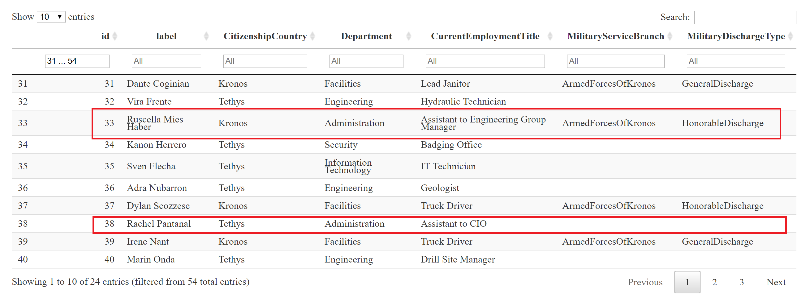

ARISE is a publication by the Asterian People’s Army APA , a paramilitary organization which has been engaged in terrorist activities funded through its criminal enterprises which include drug trafficking and has been associated with POK. Please refer to the data table diagram below.  

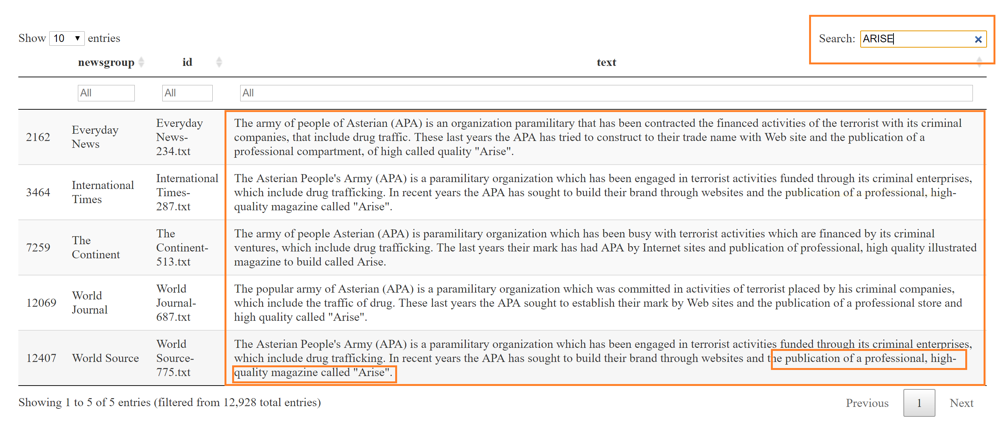
The fact that the email was sent on Sunday might also be due to some level of urgency prior to the kidnapping.
 

*Exchange of the suspicious “ARISE - Inspiration for Defenders of Kronos” email*

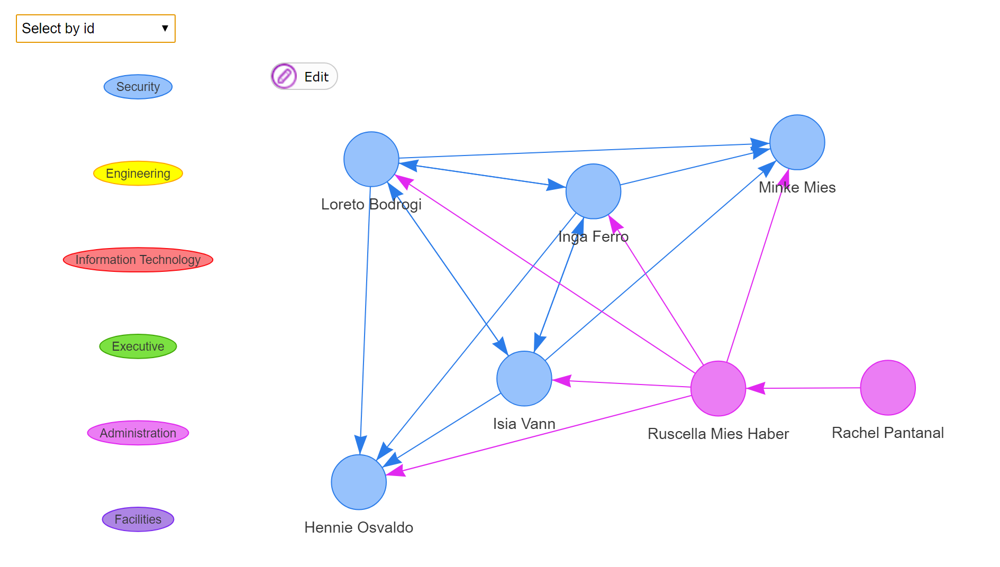

<aside>
The visNetwork package was used for the interactive visNetwork diagram. There is a manipulation feature that allows us to push the nodes further apart so that they do not look so cluttered and obscure readers' readability. When this feature is set to "True", an accompanying "edit" icon appears on the diagram to indicate that this feature is now active for the diagram. 
</aside>
 
The suspicious “ARISE” email was exchanged among the above group of colleagues. It was first sent from Rachel to Ruscella and then there was an exchange of information among Hennie, Ruscella, Loreto, Isia, Inga and Minke, suggesting an ongoing conversation about this email among the group. 

As Rachel is from the administration department, investigators may be able to find out more clues from other members of the administration department as there is frequent interaction between Rachel and her colleagues in the same department on non-work related emails suggesting a close relationship with them. 

The filter for this diagram is non-work related after office hours emails. 
 
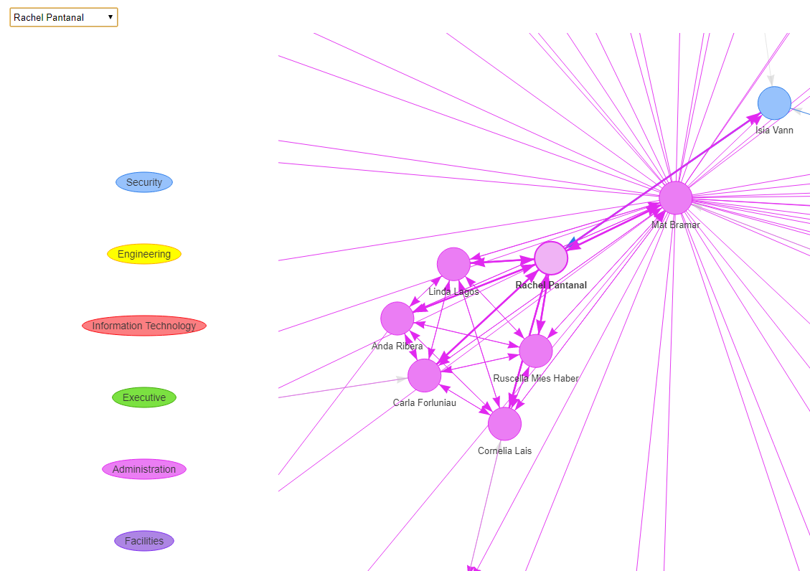 

Isia Vann has non-work related email exchanges with Rachel Pantanal (Assistant to CIO, Tethys Citizenship), Claudio Hawelon (Truck Driver, Kronos Citizenship), Mat Bramar (Assistant to CEO, Tethys Citizenship) and Inga Ferro (Site Control, Kronos Citizenship). Although Claudio did not receive the “ARISE” email, police investigators might still want to try to interview him since he seems to have a relatively closer relationship with Isia than other colleagues in the company especially since there were emails exchanges on non-work related subject after office work hours. 

The filter for this diagram is non-work related after office hours emails.

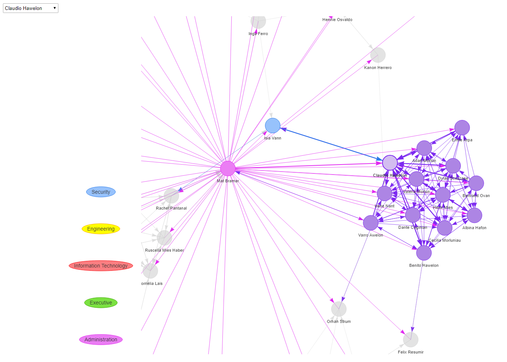 

*Clusters of relationships by department*
 
The image below shows the email exchanges for non-work-related emails outside office hours with at least 2 exchanges in the 14-day period. There are four clusters with such exchanges. One cluster is the facilities department among their own department members. Another cluster is the IT technicians without the IT manager. For the executives cluster, the cluster is among the CEO, CIO and Environmental Safety Advisor. 

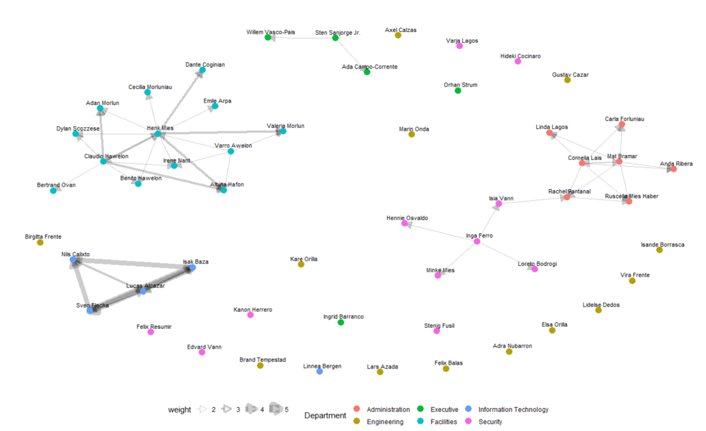

The fourth cluster is the administration cluster connected with some members of the security department through Rachel and Isia. This again highlights an anomaly as colleagues usually form closer informal relationships within their department and less often outside their department. The relationship between Rachel and Isia is worthy to be further investigated. 

It is also interesting to note that the news articles mentioned that Edvard Vann, the guard of safety at GAStech was questioned for hours on suspicion of his involvement with the kidnapping due to the similarity between his name and that of a Protector of Kronos member. However,in the above diagram, it is revealed that Edvard is not only not connected to the suspected group of people with the suspicious “Arise” email, he also does not correspond with any of the other colleagues outside office hours, suggesting that he does not have a strong personal relationship with his colleagues. Unless he uses other modes of communication, this does suggest that he may indeed not be related to the suspected “Protector of Kronos” member.  
 
*Examining both employment period and military service period to identify relationships*

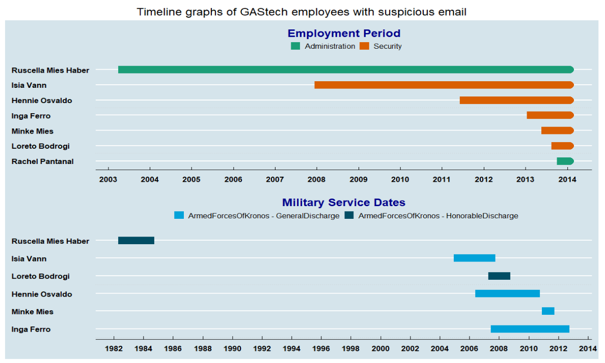 

<aside>
The patchwork package was used for placing multiple plots together in the same figure.
</aside>

In the above visualization, the data is filtered to spotlight the suspicious employees who exchanged the suspicious "ARISE" email. From the visualization, it can be seen that four out of seven of the suspicious GAStech employees were relatively new in the company, having joined less than a year since the kidnapping date. Among all the employees at GAStech, Rachel Pantanal has the shortest tenure and may potentially have entered GAStech with an agenda to help Isia Vann with his "revenge" goal. It is also possible that these newly recruited employees are part of the increasingly "radicalised" POK members that infiltrated into GAStech. They also took on roles that allow them intimate access to the executives' whereabouts (e.g. Rachel Pantanal is the assistant to CIO and the rest besides Ruscella are all in the security department).

The below visualization shows the employment period of all employees in GAStech and most of the employees have been at GAStech for many years and the suspicious employees are from a very small minority of employees who joined GAStech less than 3 years. 

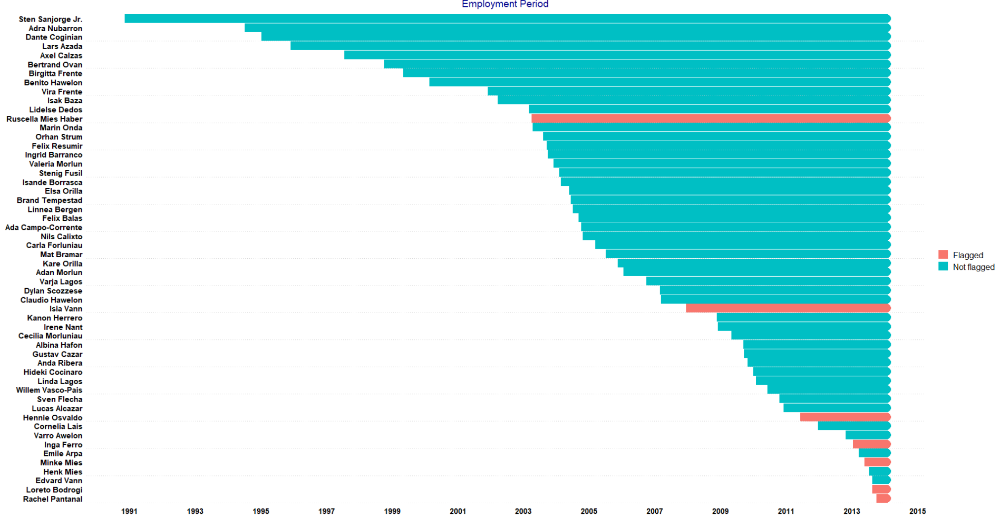
 
*Relationships with the government (military)*

An honorable discharge occurs when a military service member received a good or excellent rating for their service time, by exceeding standards for performance and personal conduct. If a service member’s performance is satisfactory but the individual failed to meet all expectations of conduct for military members, the discharge is considered a General Discharge. To receive a General Discharge from the military, there has to be some form of nonjudicial punishment to correct unacceptable military behavior or failure to meet military standards^[https://themilitarywallet.com/types-of-military-discharges/]. 

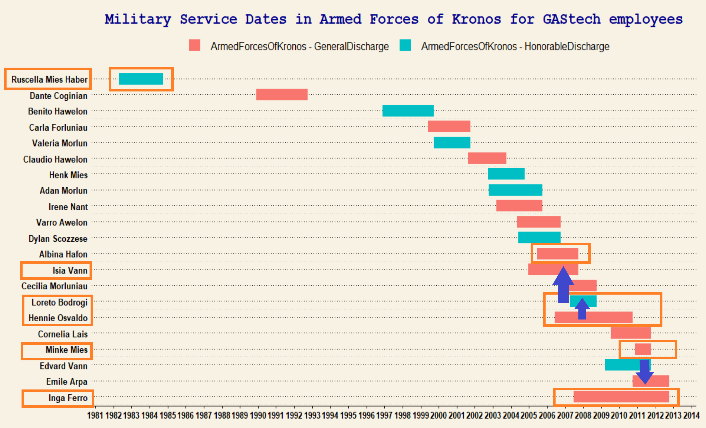 

It is worthy to investigate why the majority of the suspected group was given a general discharge and if it was due to extreme ideologies/goals. With the exception of Ruscella as she was much older, all of the suspected members in the group (Hennie, Isia, Loreto, Inga, Minke) had overlaps in service with at least one other member in this group. This means that there were likely some unofficial relationships/contact with each other in the Army before they joined GAStech. The “General Discharge” instead of “Honorable Discharge” could also potentially be a reflection of their relationships with the Krono government (i.e. concerns that Krono government has flagged out regarding them).  

As Rachel is a Tethys citizen, she did not serve in the Armed Forces of Kronos and will not be reflected in this diagram. 

*Relationships between APA, POK and GAStech*
 
The visualization below maps the potential official and unofficial relationships that the GAStech employees potentially have with APA, POK. 
 
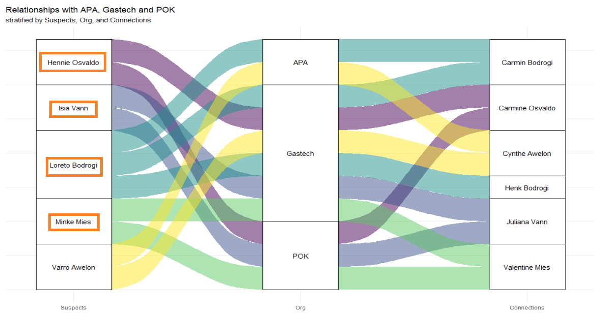 

<aside>
The ggalluvial package is a ggplot2 extension for producing alluvial plots in a tidyverse framework. This type of visualization is especially useful for categorical data. It is used to show the relationship flows in the visualization here. 
</aside>

It has come to our attention that four out of six members of the earlier mentioned suspected group have relationships with APA and POK through connected family members, assuming that the shared family name does indeed indicate that they are family and not a mere coincidence. Connected family members may share some common ideologies and affiliations and this point needs to be further investigated.

When we overlap the multiple visualizations above, they point towards the suspected group of GAStech employees as they do have a common goal through their multiple connections especially with POK and/or APA. This scenario likely has a the highest likelihood among all the scenarios. 

However, there is also the other possibility that the four GAStech executives that were claimed to be missing/kidnapped were actually on a personal impromptu golf vacation to celebrate their windfall from the IPO. The diagram below shows the email exchange with subject header containing “vacation”, suggesting that the executives were planning for a vacation in the very recent period before the supposed “kidnapping”. Note that the email headers provided for analysis were two weeks of emails prior to the "kidnapping" incident. The executives might have simply gone for a vacation to celebrate and were not kidnapped at all.

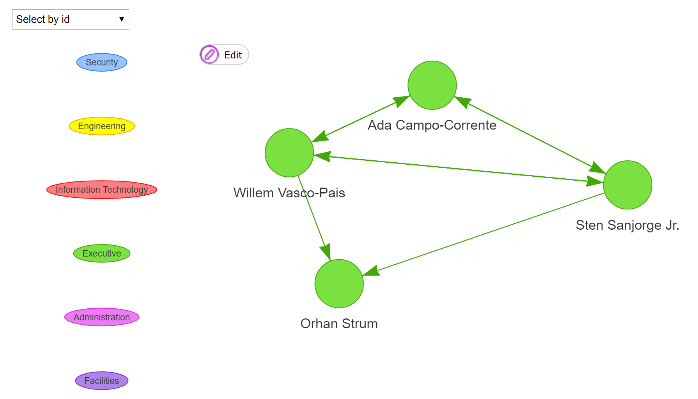 

The four of them also matches the development of the police correcting the number of missing GAStech employees from fourteen to ten. POK might have issued a ransom note to take advantage of the situation but may or may not be actually involved in the kidnapping despite their claims.  

It is also possible that the suppliers dressed in black have kidnapped the other ten employees in order to obtain a ransom from Sten Sanjorge Jr, CEO of GAStech who is now a billionare after the company’s IPO. They may not have been fully aware of the executives’ vacation plans and hence did not succeed in kidnapping them but simply captured ten other employees during their planned time window with the chaos caused by the false fire alarm. The affiliation of the suppliers is not clear but it is likely that they managed to get into the GAStech building with the help of an GAStech administrative executive who have contracted them to cater for the reunion breakfast between the Kronos government and GAStech executives. 

The police investigators are advised to investigate the above potential suspicious scenarios and look into the aforementioned possible suspects.

--

**Codes for visualizations in Question 3**

Raw text needs to be first encoded to UTF8 format before use in the data table.

To create data table of raw text:

```{r class.source="watch-out", eval=FALSE, echo=TRUE}
raw_text_utf8 <- raw_text_lda %>% mutate_if(is.character, utf8_encode)

DT::datatable(raw_text_utf8, filter = 'top') 
```

Create galluvial diagram:

```{r class.source="watch-out", eval=FALSE, echo=TRUE}

related_table <- tibble(
  Suspects = c("Loreto Bodrogi", "Loreto Bodrogi", "Varro Awelon", "Hennie Osvaldo", 
               "Isia Vann", "Isia Vann", "Minke Mies", "Minke Mies", "Varro Awelon", 
               "Hennie Osvaldo", "Loreto Bodrogi"),
  Org = c("Gastech", "Gastech", "Gastech", "Gastech", "Gastech", "POK", 
          "Gastech", "POK", "APA", "POK", "APA"),
  Connections = c("Carmin Bodrogi" , "Henk Bodrogi", "Cynthe Awelon", "Carmine Osvaldo", 
                  "Juliana Vann", "Juliana Vann", "Valentine Mies", "Valentine Mies", "Cynthe Awelon",
                  "Carmine Osvaldo", "Carmin Bodrogi"),
  n = c( 1, 1, 1, 1,1, 1,1, 1,1, 1,1)
)

ggplot(related_table,
       aes(axis1 = Suspects,
           axis2 = Org,
           axis3 = Connections
           )) +
  geom_alluvium(aes(fill = Suspects)) +
  geom_stratum() +
  geom_text(stat = "stratum", 
            aes(label = after_stat(stratum))) +
  scale_x_discrete(limits = c("Suspects", "Org", "Connections"),
                   expand = c(.1, .1)) +
  scale_fill_viridis_d() +
  labs(title = "Relationships with APA, Gastech and POK",
       subtitle = "stratified by Suspects, Org, and Connections"
       ) +
  theme_minimal() +
  theme(legend.position = "none", axis.text.y = element_blank(),axis.ticks = element_blank() ) 
```

Reading the email headers data:

```{r class.source="watch-out", eval=FALSE, echo=TRUE}
email_headers <- read_csv("email headers.csv")
```

In the email headers, the reply emails typically start with "RE". As we want unique email headers for labelling into work and non-work related emails, we will filter them out. 

Getting unique email titles for manual labelling:

```{r class.source="watch-out", eval=FALSE, echo=TRUE}
email_headers <- email_headers %>%
  filter(!str_detect(Subject, "RE: "))
```

Retain only subject header column for purpose of categorization:

```{r class.source="watch-out", eval=FALSE, echo=TRUE}
email_headers <- subset(email_headers , select = -c(From, To, Date))
```

Repetitve email headers are grouped together and a count is performed:

```{r class.source="watch-out", eval=FALSE, echo=TRUE}
email_headers_count <- email_headers %>%
        count(Subject, sort = TRUE)
```

Write to csv to perform manual labelling of 154 observations:

```{r class.source="watch-out", eval=FALSE, echo=TRUE}
#write_csv(email_headers_count, "email_headers_count.csv", append = FALSE)
```

Read csv of manually labelled 154 observations:

```{r class.source="watch-out", eval=FALSE, echo=TRUE}
email_headers_count <- read_csv("email_headers_count.csv")
```

Use dyplr full join to join back with email_headers table with 315 observations:

```{r class.source="watch-out", eval=FALSE, echo=TRUE}
email_headers <- email_headers %>% full_join(email_headers_count, by = "Subject")
```

Remove the count column: 

```{r class.source="watch-out", eval=FALSE, echo=TRUE}
email_headers <- subset(email_headers , select = -c(n))
```

The str_c function joins ombines multiple character vectors into a single character vector.

Convert data to string:

```{r class.source="watch-out", eval=FALSE, echo=TRUE}
email_headers_re <- email_headers %>%
  mutate(str_c("RE: ", Subject)) 
```

Rename the new column: 

```{r class.source="watch-out", eval=FALSE, echo=TRUE}
names(email_headers_re)[names(email_headers_re) == "str_c(\"RE: \", Subject)"] <- "Subject"
```


Add the subject type column back to original email headers table:

```{r class.source="watch-out", eval=FALSE, echo=TRUE}
email_headers_ori <- read_csv("email headers.csv")
colnames(email_headers_ori)
colnames(email_headers)
email_headers_ori <- email_headers_ori %>% left_join(email_headers, by = "Subject")
email_headers_ori <- distinct(email_headers_ori, across())
```


Ensure the left join is performed on distinct entries:

```{r class.source="watch-out", eval=FALSE, echo=TRUE}
email_headers_ori_csv <- read_csv("email headers.csv")
email_headers_ori_re <- dplyr::left_join(email_headers_ori_csv, email_headers_re)
email_headers_ori_re <- email_headers_ori_re %>% distinct()
```

Perform a left join by "Subject" column:

```{r class.source="watch-out", eval=FALSE, echo=TRUE}
email_headers_ori_re <- dplyr::left_join(email_headers_ori_re, email_headers, by="Subject")
```

Unite the subject type after left join:

```{r class.source="watch-out", eval=FALSE, echo=TRUE}
email_headers_ori_re <- email_headers_ori_re %>% 
  unite('Subject_Type', `Subject type.x`:`Subject type.y`, remove = TRUE)
```

There are some email headers that did not have the no "RE" and "RE" pairings. Such email headers form only a very small group and we will 
analyse them to determine whether they should be classified as work-related or non-work related. 

Review subject types that have not been coded:

```{r class.source="watch-out", eval=FALSE, echo=TRUE}
email_headers_ori_re_NA <- filter(email_headers_ori_re, Subject_Type == "NA_NA")
```

After reviewing them, these email headers are assessed to be non-work related email types. 

Rename the subject type to "Non-work related":

```{r class.source="watch-out", eval=FALSE, echo=TRUE}
email_headers_ori_re <- email_headers_ori_re  %>% 
  mutate_at("Subject_Type", str_replace, "NA_NA", "Non-work related") 

email_headers_ori_re <- email_headers_ori_re  %>% 
  mutate_at("Subject_Type", str_replace, "NA_", "") %>% 
  mutate_at("Subject_Type", str_replace, "_NA", "") 
```

Wrangling with date data using the 'anytime' package released in 2020 - extract day of week from sent date:

```{r class.source="watch-out", eval=FALSE, echo=TRUE}
email_headers_ori_re$SentDate <- anytime(email_headers_ori_re$Date)
email_headers_ori_re$SentDate <- iso8601(anydate(email_headers_ori_re$SentDate))
email_headers_ori_re$Weekday = wday(email_headers_ori_re$SentDate)
```

General office hours are assumed to be between 7am - 6:59pm. Drivers might be on shift but generally, it may be unusual to be sending emails outside regular office hours and requires further investigation. 

Categorize sent hour to during or outside work hours:

```{r class.source="watch-out", eval=FALSE, echo=TRUE}
#wrangling time - using the 'anytime' package released in 2020
email_headers_ori_re$SentTime <- anytime(email_headers_ori_re$Date)
email_headers_ori_re$SentHour <- hour(email_headers_ori_re$SentTime)
email_headers_ori_re <- email_headers_ori_re  %>% 
  mutate_at("SentHour", str_replace_all, c("19" = "Outside_work_hours", "20" = "Outside_work_hours", 
                                           "21" = "Outside_work_hours", "22" = "Outside_work_hours", 
                                           "18" = "During_work_hours", "17" = "During_work_hours", 
                                           "16" = "During_work_hours","15" = "During_work_hours", 
                                           "14" = "During_work_hours", "13" = "During_work_hours", 
                                           "12" = "During_work_hours", "11" = "During_work_hours", 
                                           "10" = "During_work_hours", "9" = "During_work_hours", 
                                           "8" = "During_work_hours", "7" = "During_work_hours", 
                                           "6" = "Outside_work_hours", "5" = "Outside_work_hours",
                                           "4" = "Outside_work_hours", "3" = "Outside_work_hours",
                                           "2" = "Outside_work_hours", "1" = "Outside_work_hours",
                                           "0" = "Outside_work_hours"))

email_headers_ori_re <- email_headers_ori_re  %>% 
  mutate_at("Weekday", str_replace_all, 
            c("7" = "Sunday", "6" = "Saturday", "5" = "Friday", 
              "4" = "Thursday", "3" = "Wednesday", "2" = "Tuesday", "1" = "Monday"))
```

Prepare the processed email headers data after tidying the data:

```{r class.source="watch-out", eval=FALSE, echo=TRUE}
split_to_email_headers <- separate_rows(email_headers_ori_re, To, sep = ",")
processed_email_headers <- split_to_email_headers %>% 
    tidyr::separate(From, c("Sender_First", "Sender_LastName")) %>%
    tidyr::unite('Sender_fullname',c("Sender_First", "Sender_LastName"), sep=" ") %>%
    tidyr::separate(To, c("Recipient_First", "Recipient_LastName"), sep="[,.@]") %>%
    tidyr::unite('Recipient_fullname',c("Recipient_First", "Recipient_LastName"), sep=" ")
```

Adjust for words in names for 4 employees with "-", >1 word etc as the earlier separation rule did not work as well for the more unusual name formats: 

```{r class.source="watch-out", eval=FALSE, echo=TRUE}
processed_email_headers <- processed_email_headers %>% 
  mutate_at("Sender_fullname", str_replace, "Campo", "Campo-Corrente") %>% 
  mutate_at("Sender_fullname", str_replace, "Sanjorge", "Sanjorge Jr.") %>% 
  mutate_at("Sender_fullname", str_replace, "Vasco", "Vasco-Pais") %>% 
  mutate_at("Sender_fullname", str_replace, "Ruscella Mies", "Ruscella Mies Haber") %>%
  mutate_at("Recipient_fullname", str_replace, "Ruscella Mies", "Ruscella Mies Haber") %>% 
  mutate_at("Recipient_fullname", str_replace, "Jr", "Jr.") 
```
  
Remove leading white space: 

```{r class.source="watch-out", eval=FALSE, echo=TRUE}
processed_email_headers$Recipient_fullname <- 
  trimws(processed_email_headers$Recipient_fullname, "l")
```
  
Filter out cases where sender sends to him/herself (likely in cc), reduces to 8170 obs:

```{r class.source="watch-out", eval=FALSE, echo=TRUE}
processed_email_headers <- 
processed_email_headers[processed_email_headers$Sender_fullname!=processed_email_headers$Recipient_fullname,]
```

Sometimes, after reviewing the data output, one may realise that the classification is incorrect. The below code chunk illustrates what to do when an email type has been misclassified. 

Changing the classification of email subject types:

```{r class.source="watch-out", eval=FALSE, echo=TRUE}
processed_email_headers <- processed_email_headers %>% 
    tidyr::unite('Merged',c("Subject", "Subject_Type"), sep="_")

processed_email_headers <- processed_email_headers %>% 
  mutate_at("Merged", str_replace, "Upcoming birthdays_Non-work related", "Upcoming birthdays_Work related") %>%
  mutate_at("Merged", str_replace, "RE: Upcoming birthdays_Non-work related", 
            "RE: Upcoming birthdays_Work related") %>%
  mutate_at("Merged", str_replace, "FW: ARISE - Inspiration for Defenders of Kronos_Work related", 
            "FW: ARISE - Inspiration for Defenders of Kronos_Non-work related") %>% 
  mutate_at("Merged", str_replace, "RE: FW: ARISE - Inspiration for Defenders of Kronos_Work related", 
            "RE: FW: ARISE - Inspiration for Defenders of Kronos_Non-work related")

processed_email_headers <- processed_email_headers %>% 
    tidyr::separate(Merged, c("Subject", "Subject_Type"), sep="_", remove = TRUE)
```


Changing the classification of sent period:

```{r class.source="watch-out", eval=FALSE, echo=TRUE}
processed_email_headers <- processed_email_headers %>% 
    tidyr::unite('Merged',c("Weekday", "SentHour"), sep="-")

processed_email_headers <- processed_email_headers  %>% 
  mutate_at("Merged", str_replace, "Sunday-During_work_hours", "Sunday-Outside_work_hours")

processed_email_headers <- processed_email_headers %>% 
    tidyr::separate(Merged, c("Weekday", "SentHour"), sep="-", remove = TRUE)
```

Defining sources and destinations for network diagram:

```{r class.source="watch-out", eval=FALSE, echo=TRUE}
sources <- processed_email_headers %>%
  distinct(Sender_fullname) %>%
  rename(label = Sender_fullname)

destinations <- processed_email_headers %>%
  distinct(Recipient_fullname) %>%
  rename(label = Recipient_fullname)
```

Read in employee records data that will be used to prepare nodes:

```{r class.source="watch-out", eval=FALSE, echo=TRUE}
employee_records <- read_excel("EmployeeRecords.xlsx", sheet = "Employee Records")
employee_records  <- subset(employee_records, 
                            select = -c(BirthDate, BirthCountry, Gender, 
                                        CitizenshipBasis, CitizenshipStartDate, 
                                        PassportCountry, PassportIssueDate, 
                                        PassportExpirationDate, CurrentEmploymentStartDate, 
                                         EmailAddress, MilitaryDischargeDate ))
```

Process employee records to combine first and last name to full name:

```{r class.source="watch-out", eval=FALSE, echo=TRUE}
employee_records <- employee_records %>% 
    tidyr::unite('Employee_Name',c("FirstName", "LastName"), sep=" ", remove = TRUE)
```

Rename "CurrentEmploymentType" to the more intuitive title, "Department":

```{r class.source="watch-out", eval=FALSE, echo=TRUE}
names(employee_records)[names(employee_records) == "CurrentEmploymentType"] <- "Department"
```

There are 54 employees and there should be 54 rows.

Create and review the nodes:

```{r class.source="watch-out", eval=FALSE, echo=TRUE}
nodes <- full_join(sources, destinations, by = "label")
nodes <- nodes %>% rowid_to_column("id")
nodes <- nodes %>% left_join(employee_records, by = c("label"="Employee_Name"))
nodes <- distinct(nodes, across())

nodes
```

Prepare the route:

```{r class.source="watch-out", eval=FALSE, echo=TRUE}
per_route <- processed_email_headers %>%  
  filter(Subject_Type == "Non-work related") %>%
  group_by(Sender_fullname, Recipient_fullname, Weekday) %>%
  summarise(weight = n()) %>% 
  filter(weight > 0) %>%
  ungroup()
per_route
```

The grepl function allows us to specify specific key words in the subject header that we want to filter out for analysis.

Here, the example shown is to filter out "ARISE" email but note that we repeat this for other specific emails such as "vacation". 

A sample of modifying the route to filter out targeted email conversations:

```{r class.source="watch-out", eval=FALSE, echo=TRUE}
per_route_v2 <- 
 dplyr::filter(processed_email_headers , grepl("ARISE", Subject)) %>%
               
  group_by(Sender_fullname, Recipient_fullname, Weekday) %>%
  summarise(weight = n()) %>% 
  filter(weight > 0) %>%
  ungroup()
per_route_v2
```

Creating the edges for the network diagram:

```{r class.source="watch-out", eval=FALSE, echo=TRUE}
edges <- per_route %>% 
  left_join(nodes, by = c("Sender_fullname" = "label")) %>% 
  rename(from = id)

edges <- edges %>% 
  left_join(nodes, by = c("Recipient_fullname" = "label")) %>% 
  rename(to = id)

edges
```

Creating the tibble graph:

```{r class.source="watch-out", eval=FALSE, echo=TRUE}
GAStech_graph <- tbl_graph(nodes = nodes, edges = edges, directed = TRUE)
GAStech_graph
```

Activating the edges:

```{r class.source="watch-out", eval=FALSE, echo=TRUE}
GAStech_graph %>%
  activate(edges) %>%
  arrange(desc(weight))
```

Creating facet graphs for non-work related emails on a weekday by department:

```{r class.source="watch-out", eval=FALSE, echo=TRUE}
set.seed(123)

set_graph_style()

g <- ggraph(GAStech_graph, layout = "fr") + geom_edge_link(aes(width=weight), alpha=0.2) +
     scale_edge_width(range = c(0.1,5)) + geom_node_point(aes(color = Department), size = 3) +
     theme(text=element_text(family="Arial", size=16)) +  geom_node_text(aes(label = id)) 

g + facet_edges(~Weekday) + theme(legend.position = "bottom") +
    ggtitle("Non-work related emails exchanged")
``` 

Prepare nodes for visNetwork:

```{r class.source="watch-out", eval=FALSE, echo=TRUE}
nodes_dep <- nodes %>%
  rename(group = Department)
```

Apply visNetwork function:

```{r class.source="watch-out", eval=FALSE, echo=TRUE}
visNetwork(nodes_dep, edges) %>%
  visIgraphLayout(layout = "layout_with_fr") %>%
  visOptions(highlightNearest = TRUE, nodesIdSelection = TRUE, manipulation = TRUE) %>%
  visLegend() %>%
  visLayout(randomSeed = 123)
```

Create data table for nodes for easy identification of ids to full names and other details:

```{r class.source="watch-out", eval=FALSE, echo=TRUE}
DT::datatable(nodes, filter = 'top') %>%
   formatStyle(0, target = 'row', lineHeight='75%')
```

Data processing for analyzing military service periods:

```{r class.source="watch-out", eval=FALSE, echo=TRUE}
employee_records <- read_excel("EmployeeRecords.xlsx", sheet = "Employee Records")
employee_records  <- employee_records %>% filter(!str_detect(MilitaryDischargeType, " "))
employee_records <- subset(employee_records , select = -c(EmailAddress))
glimpse(employee_records)
```

```{r class.source="watch-out", eval=FALSE, echo=TRUE}
employee_records <- employee_records %>% 
    tidyr::unite('Fullname',c("FirstName", "LastName"), sep=" ")
glimpse(employee_records)
```

```{r class.source="watch-out", eval=FALSE, echo=TRUE}
employee_records$BirthDate <-  ymd(employee_records$BirthDate)
glimpse(employee_records)
```

```{r class.source="watch-out", eval=FALSE, echo=TRUE}
employee_records$MilitaryDischargeDate <-  ymd(employee_records$MilitaryDischargeDate)
```

```{r class.source="watch-out", eval=FALSE, echo=TRUE}
employee_records_Kronos <- employee_records %>% filter(CitizenshipCountry == "Kronos")

glimpse(employee_records_Kronos) 
```

Based on the factbook, all Krono citizens need to serve the military at age 18. Hence, we define the militart start date with the formula of birthdate + 18 years. 

```{r class.source="watch-out", eval=FALSE, echo=TRUE}
employee_records_Kronos$MilitaryStartDate <- employee_records_Kronos$BirthDate %m+% years(18) 
glimpse(employee_records_Kronos) 
```

```{r class.source="watch-out", eval=FALSE, echo=TRUE}
employee_records_Kronos <- employee_records_Kronos %>% 
    tidyr::unite('Branch_and_Discharge',c("MilitaryServiceBranch", "MilitaryDischargeType"), sep=" - ")
glimpse(employee_records_Kronos) 
```

Add a Column to a Dataframe Based on Other Column with dplyr - flagging employees with the suspicious ARISE email:

```{r class.source="watch-out", eval=FALSE, echo=TRUE}
employee_records_Kronos <- employee_records_Kronos %>%
  mutate(Status = case_when(
    str_detect(Fullname, "Rachel Pantanal") ~ "Flagged",
    str_detect(Fullname, "Ruscella Mies Haber") ~ "Flagged",
    str_detect(Fullname, "Hennie Osvaldo") ~ "Flagged",
    str_detect(Fullname, "Isia Vann") ~ "Flagged",
    str_detect(Fullname, "Loreto Bodrogi") ~ "Flagged",
    str_detect(Fullname, "Inga Ferro") ~ "Flagged",
    str_detect(Fullname, "Minke Mies") ~ "Flagged",
    TRUE ~ "Not flagged"
    ))
```

A filter is added to isolate employees who received the suspicious "ARISE" email. 
However, this step is repeated without the filter to obtain military service periods for all Krono citizen employee citizens for one of the visualization.

```{r class.source="watch-out", eval=FALSE, echo=TRUE}
employee_records_Kronos <- subset(employee_records_Kronos , select = -c(BirthDate, BirthCountry, Gender, CitizenshipCountry, CitizenshipBasis, CitizenshipStartDate, PassportCountry, PassportIssueDate, PassportExpirationDate, CurrentEmploymentType, CurrentEmploymentTitle,CurrentEmploymentStartDate ))


employee_records_Kronos <- employee_records_Kronos %>% filter(Status == "Flagged")
employee_records_Kronos <- subset(employee_records_Kronos,  select = -c(Status))
employee_records_Kronos

```

```{r class.source="watch-out", eval=FALSE, echo=TRUE}
employee_records_Kronos.long <- employee_records_Kronos %>%
  mutate(Start = ymd(MilitaryStartDate),
         End = ymd(MilitaryDischargeDate)) %>%
  gather(date.type, employee_records_Kronos.date, -c(Branch_and_Discharge, Fullname)) %>%
  arrange(date.type, employee_records_Kronos.date) %>%
  mutate(Fullname = factor(Fullname, levels=rev(unique(Fullname)), ordered=TRUE))
```

```{r class.source="watch-out", eval=FALSE, echo=TRUE}
theme_update(plot.title = element_text(hjust = 0.5))
theme_gantt <- function(base_size=11, base_family="Source Sans Pro Light") {
  ret <- theme_bw(base_size, base_family) %+replace%
    theme(panel.background = element_rect(fill="#ffffff", colour=NA),
          axis.title.x=element_text(vjust=-0.2), axis.title.y=element_text(vjust=1.5),
          title=element_text(vjust=1.2, family="Source Sans Pro Semibold"),
          panel.border = element_blank(), axis.line=element_blank(),
          panel.grid.minor=element_blank(),
          panel.grid.major.y = element_blank(),
          panel.grid.major.x = element_line(size=0.5, colour="grey80"),
          axis.ticks=element_blank(),
          legend.position="bottom", 
          axis.title=element_text(size=rel(0.8), family="Source Sans Pro Semibold"),
          strip.text=element_text(size=rel(1), family="Source Sans Pro Semibold"),
          strip.background=element_rect(fill="#ffffff", colour=NA),
          panel.spacing.y=unit(1.5, "lines"),
          legend.key = element_blank())
  
  ret
}

# Calculate where to put the dotted lines that show up every three entries
x.breaks <- seq(length(employee_records_Kronos$Fullname) + 0.5 - 3, 0, by=-3)

# Build plot
timeline_Kronosmilitary <- ggplot(employee_records_Kronos.long, 
                                  aes(x=Fullname, y=employee_records_Kronos.date, colour=Branch_and_Discharge)) + 
                                  geom_line(size=6) + 
                                  geom_vline(xintercept=x.breaks, colour="grey80", linetype="dotted") + 
                                  guides(colour=guide_legend(title=NULL)) +
                                  labs(x=NULL, y=NULL) + coord_flip() +
                                  scale_y_date(date_breaks="2 years", date_labels = ("%Y")) +
                                  theme_economist() + scale_colour_economist() + 
                                  theme(axis.text.x=element_text(angle=0, vjust = 1, size = 12, face = 'bold'), 
                                        axis.text.y = element_text(size = 12, face = 'bold'), 
                                        legend.text = element_text(size=12)) +
                                  ggtitle("Military Service Dates") + 
                                  theme(plot.title = element_text(hjust = 0.5, size = 18, color = "darkblue"))

timeline_Kronosmilitary
```

Repeating the steps to create gantt chart for employee's employment start date.
The kidnapping start date is set on Jan 2014 to allow us to see the service period from employment start date to the "suspected kidnapping" date. 

```{r class.source="watch-out", eval=FALSE, echo=TRUE}
employee_records_startdate <- subset(employee_records_startdate , select = -c(BirthDate, BirthCountry, Gender, CitizenshipCountry, CitizenshipBasis, CitizenshipStartDate, PassportCountry, PassportIssueDate, PassportExpirationDate, CurrentEmploymentTitle, EmailAddress, MilitaryDischargeDate, MilitaryDischargeType, MilitaryServiceBranch))

employee_records_startdate$KidnappingStartDate <- ymd('2014-01-20')
employee_records_startdate$CurrentEmploymentStartDate <- ymd(employee_records_startdate$CurrentEmploymentStartDate)

#filter is added to improve focus on employees who are flagged
employee_records_startdate <- employee_records_startdate %>% filter(Status == "Flagged")
employee_records_startdate <- subset(employee_records_startdate,  select = -c(Status))
employee_records_startdate
```

```{r class.source="watch-out", eval=FALSE, echo=TRUE}
employee_records_startdate.long <- employee_records_startdate %>%
  mutate(Start = ymd(CurrentEmploymentStartDate),
         End = ymd(KidnappingStartDate)) %>%
  gather(date.type, employee_records_startdate.date, -c(CurrentEmploymentType, Fullname)) %>%
  arrange(date.type, employee_records_startdate.date) %>%
  mutate(Fullname = factor(Fullname, levels=rev(unique(Fullname)), ordered=TRUE))
```

```{r class.source="watch-out", eval=FALSE, echo=TRUE}
# Custom theme for making a clean Gantt chart
theme_update(plot.title = element_text(hjust = 0.5))
theme_gantt <- function(base_size=11, base_family="Source Sans Pro Light") {
  ret <- theme_bw(base_size, base_family) %+replace%
    theme(panel.background = element_rect(fill="#ffffff", colour=NA),
          axis.title.x=element_text(vjust=-0.2), axis.title.y=element_text(vjust=1.5),
          title=element_text(vjust=1.2, family="Source Sans Pro Semibold"),
          panel.border = element_blank(), axis.line=element_blank(),
          panel.grid.minor=element_blank(),
          panel.grid.major.y = element_blank(),
          panel.grid.major.x = element_line(size=0.5, colour="grey80"),
          axis.ticks=element_blank(),
          legend.position="bottom", 
          axis.title=element_text(size=rel(0.8), family="Source Sans Pro Semibold"),
          strip.text=element_text(size=rel(1), family="Source Sans Pro Semibold"),
          strip.background=element_rect(fill="#ffffff", colour=NA),
          panel.spacing.y=unit(1.5, "lines"),
          legend.key = element_blank())
  
  ret
}

# Calculate where to put the dotted lines that show up every three entries
x.breaks <- seq(length(employee_records_startdate$Fullname) + 0.5 - 3, 0, by=-3)

# Build plot
timeline_p2 <- ggplot(employee_records_startdate.long, 
                      aes(x=Fullname, y=employee_records_startdate.date, colour=CurrentEmploymentType)) + 
                      geom_line(size=6) + 
                      geom_vline(xintercept=x.breaks, colour="grey80", linetype="dotted") + 
                      guides(colour=guide_legend(title=NULL)) +
                      labs(x=NULL, y=NULL) + coord_flip() +
                      scale_y_date(date_breaks="1 year", date_labels = ("%Y")) +
                      theme_economist() + scale_color_brewer(palette = "Dark2") + 
                      theme(axis.text.x=element_text(angle=0, vjust = 1, size = 12, face = 'bold'), 
                            axis.text.y = element_text(size = 12, face = 'bold'), 
                            legend.text = element_text(size=12)) + ggtitle("Employment Period") + 
                      theme(plot.title = element_text(hjust = 0.5, size = 18, color = "darkblue"))

timeline_p2  
```

Patchwork allows the plots to be joined together in a figure.

Using patchwork:

```{r class.source="watch-out", eval=FALSE, echo=TRUE}
patchwork <- timeline_p2 / timeline_Kronosmilitary

patchwork + 
  plot_annotation(title = 'Timeline graphs of GAStech employees with suspicious email',
                  theme = theme(plot.title = element_text(size = 18))) & 
  theme(text = element_text('Roboto Condensed'))
```


# References
* http://visualdata.wustl.edu/varepository/VAST%20Challenge%202014/challenges/MC1%20-%20Disappearance%20at%20GASTech/entries/Peking%20University/ 

* http://visualdata.wustl.edu/varepository/VAST%20Challenge%202014/challenges/MC1%20-%20Disappearance%20at%20GASTech/entries/Georgia%20Institute%20of%20Technology/

* http://visualdata.wustl.edu/varepository/VAST%20Challenge%202014/challenges/MC1%20-%20Disappearance%20at%20GASTech/entries/Tianjin%20University%20-%20Gao/

* https://knowledger.rbind.io/post/topic-modeling-using-r/

* https://kgjerde.github.io/corporaexplorer/articles/jane_austen.html 

* https://ldavis.cpsievert.me/reviews/reviews.html 

* https://rpubs.com/cosmopolitanvan/topicmodeling 

* https://bookdown.org/yih_huynh/Guide-to-R-Book/tidyverse.html 